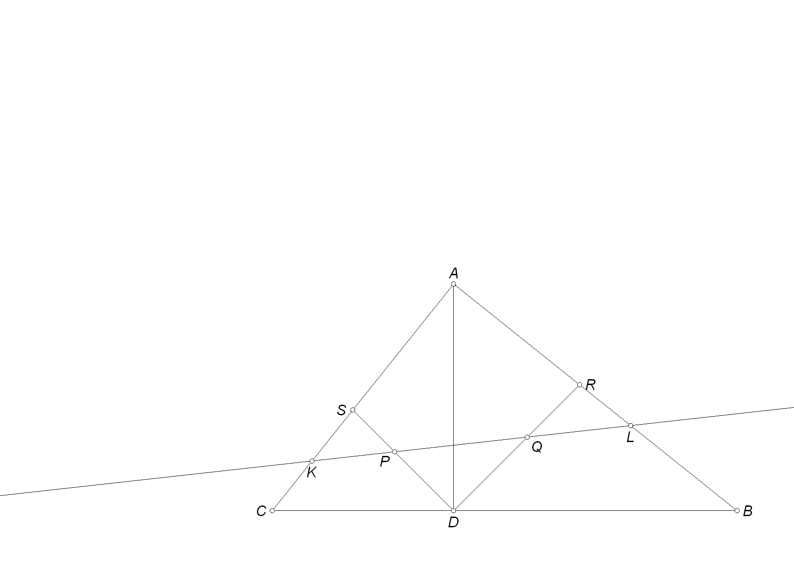

題目：直角三角形ABC，$\angle A$ 為直角，AD為高，P、Q分別是 $\triangle ADC$、$\triangle BDA$的內心，直線 PQ 與 $\overline{AC}$、$\overline{AB}$ 交於 $K$、$L$，則 $\triangle AKL\le \frac{1}{2} \triangle ABC$。

證明：直角三角形ADC與直角三角形BDA為相似三角形，故對應邊成比例，對應的直角到內心的距離也成比例，即
$$\frac{\overline{AD}}{\overline{DC}}=\frac{\overline{BD}}{\overline{AD}}=\frac{\overline{DQ}}{\overline{DP}}$$
又 $\angle PDQ$為直角，故 $\triangle QDP \sim \triangle ADC \sim \triangle BDA$。
$\angle ALQ=\angle ARD -\angle RQL=(\angle ABD+45^{\circ})-\angle PQD=45^\circ$。

三角形AQD與三角形AQL之間，三對應角相等且共用AQ邊，所以 $\triangle AQD\cong \triangle AQL$，故 $\overline{AD}=\overline{AL}$。

同理 $\overline{AD}=\overline{AK}$。

$\triangle AKL=\frac12 \overline{AK}\cdot \overline{AL}=\frac12\overline{AD}^2=\frac12 \overline{AD}\cdot\overline{AD}\le \frac12(\frac12\overline{BC}) \overline{AD}=\frac12
\triangle ABC$。
